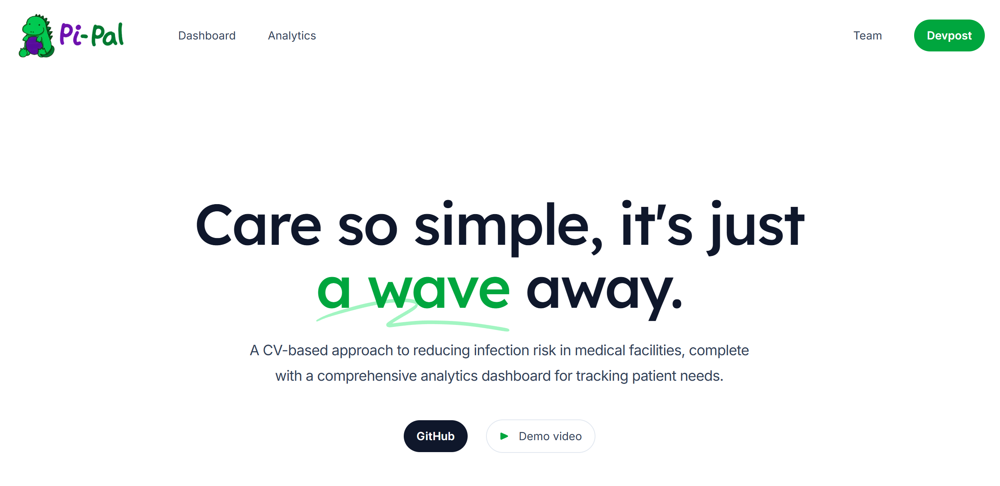
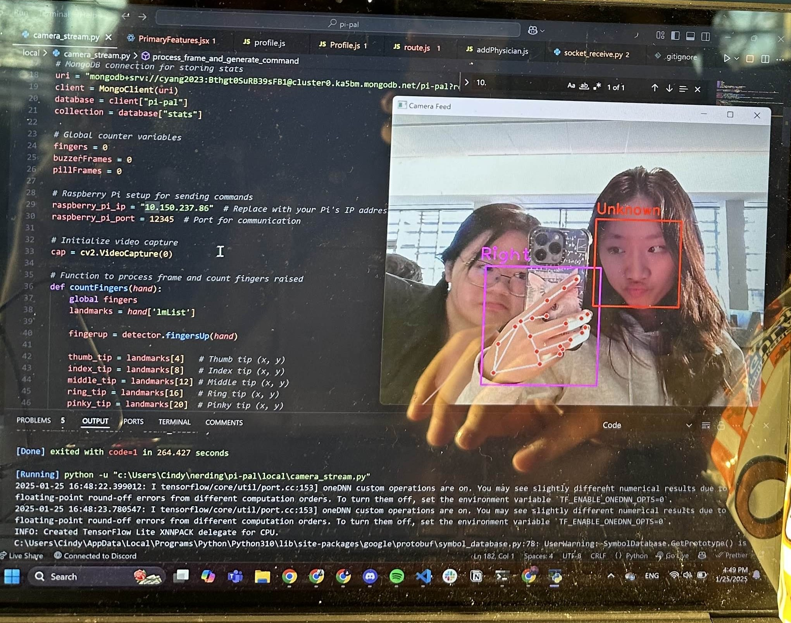
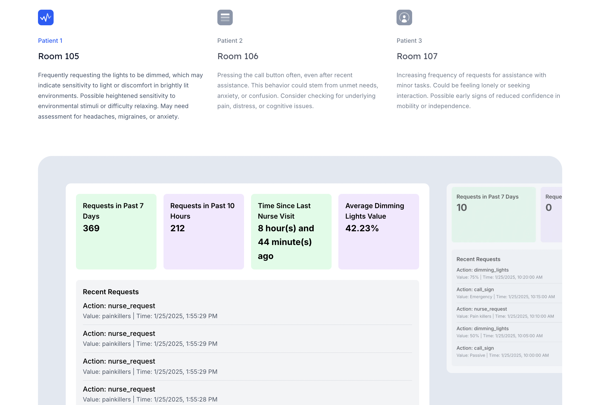
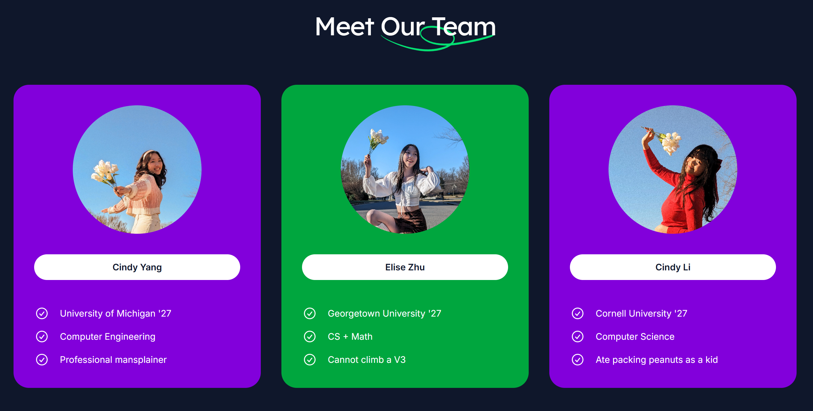

<!-- PROJECT LOGO -->
 

    

  <h1 align="center">Pi-Pal</h1>

  

    Care so simple, it's just a wave away.
     
    <a href="https://devpost.com/software/pi-pal"><strong>Devpost »</strong></a>
     
     
    <a href="https://www.linkedin.com/in/cindy-li-569a30187/">Cindy Li</a>
    ·
    <a href="https://www.linkedin.com/in/2023cyang/">Cindy Yang</a>
    ·
    <a href="https://www.linkedin.com/in/elise-yz/">Elise Zhu</a>
  

<!-- TABLE OF CONTENTS -->

  
Table of Contents

  <ol>
    <li>
      <a href="#about-the-project">About The Project</a>
      <ul>
        <li><a href="#built-with">Built With</a></li>
      </ul>
    </li>
    <li>
      <a href="#technologies">Technologies</a>
      <ul>
        <li><a href="#roboflow">Roboflow</a></li>
        <li><a href="#streamlit">Streamlit</a></li>
        <li><a href="#matlab">Matlab</a></li>
        <li><a href="#optimizations">Optimizations</a></li>
      </ul>
    </li>
    <li><a href="#contact">Contact</a></li>
    <li><a href="#acknowledgments">Acknowledgments</a></li>
  </ol>

<!-- ABOUT THE PROJECT -->
## About The Project

Imagine a hospital where patients can adjust their room's lighting, temperature, or even call for assistance—all with a simple gesture. Picture nurses administering medications to patients without physical contact, ensuring hygiene, speed, and efficiency. Welcome to Pi-Pal, a cutting-edge healthcare solution that blends gesture recognition technology with smart automation to redefine patient comfort and nurse productivity.

**Problem**

Hospitals often rely on manual controls and physical interaction for basic tasks, making them cumbersome for patients with mobility challenges or contagious illnesses.
Traditional medicine dispensation requires physical contact, increasing the risk of contamination and exposure for both nurses and patients, especially during pandemics.

**Our Solution**

Pi-Pal introduces a gesture-controlled hospital room system powered by an advanced computer vision model and demo-ed with socket connections to a Raspberry Pi. Here's what it offers:

- Contactless Environment Control: Patients can adjust lighting and call for assisstance using hand gestures, tailored to their mobility.

- Contactless Medicine Dispensal: Using gesture controls and facial recognition, nurses can unlock and dispense pre-assigned medications through a hygienic, automated system.

- Efficient Workflow: Track all requests and actions in real-time with a streamlined UI, ensuring timely responses and efficient patient care.

### Built With

[![OpenCV][OpenCV]][OpenCV-url]
[![Mediapipe][Mediapipe]][Mediapipe-url]
[![Python][Python]][Python-url]
[![Nextjs][Nextjs]][Nextjs-url]
[![Databricks][Databricks]][Databricks-url]
[![MongoDB][MongoDB]][MongoDB-url]
[![GoDaddy][GoDaddy]][GoDaddy-url]
[![Rpi][Rpi]][Rpi-url]
[![Tailwind][Tailwind]][Tailwind-url]

(<a href="#readme-top">back to top</a>)

<!-- GETTING STARTED -->
## Technologies

### Computer Vision

Our solution leverages OpenCV and MediaPipe for real-time gesture and face detection, ensuring high accuracy and efficiency in dynamic hospital environments.

Gesture Detection: Using MediaPipe’s hand tracking module, we accurately identify and interpret patient gestures, such as holding up fingers to adjust lighting or raising a call sign to call for assistance. This ensures a seamless, intuitive interface that works even in low-light or cluttered environments.

Face Detection for Nurse Authentication: MediaPipe Face Detection, combined with OpenCV, provides a secure and contactless method for nurse verification before dispensing medication. By recognizing authorized personnel in real time, we eliminate the need for physical contact with dispensing systems, enhancing both hygiene and security.

Efficiency with OpenCV: OpenCV handles video feed processing, enabling smooth real-time performance with minimal latency. Its integration ensures that gesture recognition operates seamlessly on affordable hardware, making the system scalable for widespread hospital deployment.

### Hardware Pipeline

To bridge the gap between gesture recognition and physical hardware control, we utilized sockets to send real-time commands from our gesture detection system to a Raspberry Pi, which acts as the central hub for managing room devices.

**Sockets for Real-Time Communication:**

Our system uses Python sockets to establish a seamless communication channel between the gesture detection module (running on a laptop or server) and the Raspberry Pi.
When a gesture is detected , the corresponding command is sent to the Raspberry Pi over a TCP connection. This setup ensures immediate responsiveness, making the interaction feel smooth and intuitive.

The use of sockets allows the gesture detection system to run on a powerful external machine, while the Raspberry Pi focuses solely on device control, reducing load and making the system highly modular.

This architecture makes it easy to add more devices or expand functionality without disrupting the core setup.

**Hardware Integration with GPIO:**

The Raspberry Pi is wired to control essential room devices via its GPIO (General-Purpose Input/Output) pins:

- LEDs: Represent the lighting in the room; dimness can be finely personalized by adjusting the PWM (Pulse Width Modulation) signal.

- Buzzer: Alerts nurses when a patient calls for assistance

- Servo Motor: Enables contactless medicine dispensing by controlling a small 3D-printed mechanism to deliver medication trays directly to patients.

### Analytics

Our system integrates with Databricks and OpenAI for real-time data processing and analytics, enabling hospitals to monitor patient requests, nurse responses, and room conditions in a centralized dashboard. All data from the backend servers are stored in MongoDB for easy access and retrieval.

We display key metrics on a user-friendly interface coded using Next.js and Tailwind CSS, ensuring that hospital staff can quickly access and act on critical information. This frontend is hosted on GoDaddy.

<!-- CONTACT -->
## Contact

Cindy Li (face recognition, analytics) - cl2674@cornell.edu

Cindy Yang (rpi pipeline, frontend) - cwyang@umich.edu

Elise Zhu (gesture recognition, logo) - eyz7@georgetown.edu

<!-- MARKDOWN LINKS & IMAGES -->
<!-- https://www.markdownguide.org/basic-syntax/#reference-style-links -->
[OpenCV]: https://img.shields.io/badge/opencv-5C3EE8?style=for-the-badge&logo=opencv&logoColor=white
[OpenCV-url]: https://opencv.org/
[Mediapipe]: https://img.shields.io/badge/mediapipe-0097A7?style=for-the-badge&logo=mediapipe&logoColor=white
[Mediapipe-url]: https://github.com/google-ai-edge/mediapipe
[Python]: https://img.shields.io/badge/Python-3776AB?style=for-the-badge&logo=python&logoColor=white
[Python-url]: https://www.python.org/
[Nextjs]: https://img.shields.io/badge/Nextjs-000000?style=for-the-badge&logo=Next.js&logoColor=white
[Nextjs-url]: https://nextjs.org/
[Databricks]: https://img.shields.io/badge/databricks-FF3621?style=for-the-badge&logo=Databricks&logoColor=white
[Databricks-url]: https://www.databricks.com/product/open-source
[MongoDB]: https://img.shields.io/badge/MongoDB-47A248?style=for-the-badge&logo=MongoDB&logoColor=white
[MongoDB-url]: https://www.mongodb.com/
[GoDaddy]: https://img.shields.io/badge/GoDaddy-1BDBDB?style=for-the-badge&logo=GoDaddy&logoColor=white
[GoDaddy-url]: https://www.godaddy.com/
[Rpi]: https://img.shields.io/badge/RaspberryPi-A22846?style=for-the-badge&logo=Raspberry-Pi&logoColor=white
[Rpi-url]: https://www.raspberrypi.org/
[Tailwind]: https://img.shields.io/badge/TailwindCSS-06B6D4?style=for-the-badge&logo=Tailwind-CSS&logoColor=white
[Tailwind-url]: https://tailwindcss.com/